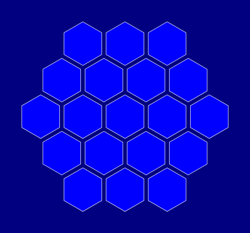
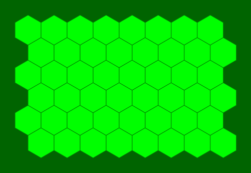
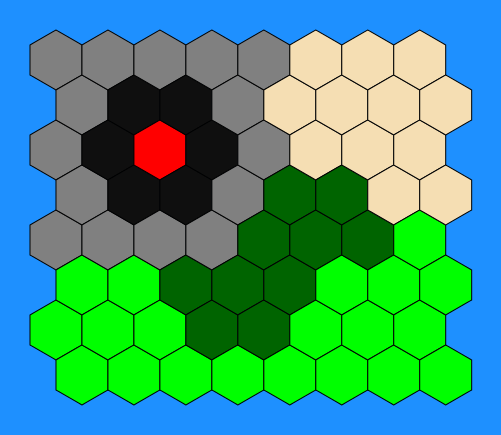

# Hex Generator

A simple program for generating a board with hexagonal fields (as a SVG file). Such a board can be used for board game prototyping or as a replacement for a missing component.

## Requirements
This program requires Python 3.x and svgwrite library.
## Usage
Hex Generator can be used without any options:

    hex_generator.py

This command creates a hexagonal, black and white board and saves it as 'board.svg'. Additional options can be specified to modify this default behavior, including:
* changing the shape of the board (hexagon, triangle, parallelogram)
* changing the size of hexagons
* changing the spacing between hexagons
* adding custom css styles
* changing the name of the output file

For a full list of options, please refer to the program's help (`hex_generator.py -h`).

## Board import and export

Hex Generator can export a board as a text file (using `-E` flag). For a default board such a file looks like this:

```
0 0 1 1 1
0 1 1 1 1
1 1 1 1 1
1 1 1 1 0
1 1 1 0 0
```

Each number represents one field. It also defines the type of the field. By default type 0 means that a field is absent (it will not be displayed in a SVG file, unless option `-a` is used).

After a text file is exported, it can be modified manually to change the layout of the board or the type of the fields. Non-negative integers should be used as field types. Fields in one row should be separated by spaces, rows should be separated by line breaks. Using rows of equal length is recommended, but not required.

A modified text file can then be imported by the program (`-i FILENAME`). Hex Generator will parse it using [axial coordinates](http://www.redblobgames.com/grids/hexagons/#coordinates) and apply css styles to different types of fields (if css style was defined with `-c`). Fields can be styled using `.hex-field` (for all fields) and `.hex-field-X` (for fields of type X).

## Samples






