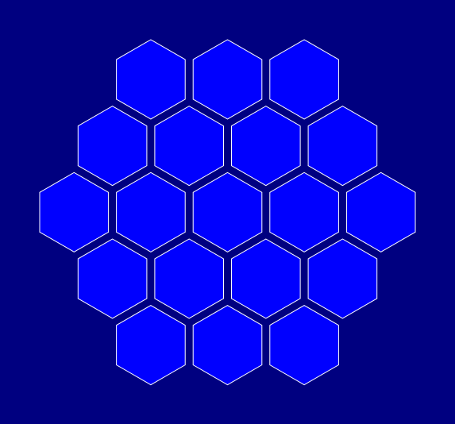
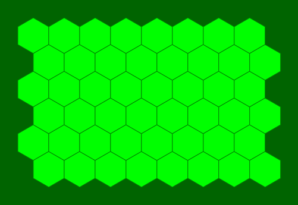
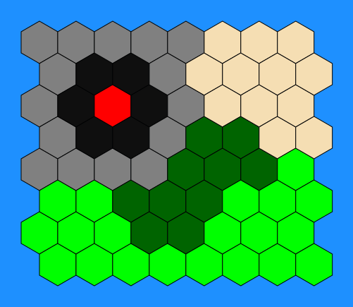

# Hex Generator

A simple program for generating a board with hexagonal fields (as a SVG file). Such a board can be used for board game prototyping or as a replacement for a missing component.

## Requirements
This program requires Python 3.x and svgwrite library.
## Usage
Hex Generator can be used without any options:

    hex_generator.py

This command will create a hexagonal, black and white board and save it as 'board.svg'. Additional options can be specified to modify this default behaviour, including:
* changing the shape of the board (hexagon, triangle, parallelogram)
* changing the size of hexagons
* changing the spacing between hexagons
* adding custom css styles
* changing the name of the output file

For full list of options, please refer to the program's help (`hex_generator.py -h`).

## Board import and export

Board can be exported as a text file (using -E flag). For a default board such a file will look like this:

```
0 0 1 1 1
0 1 1 1 1
1 1 1 1 1
1 1 1 1 0
1 1 1 0 0

```

Each number represents one field. By default type 0 means that a field is absent.


A text file can then be imported by the program using `-i FILENAME`.

## Examples






An example of a board text file can be found in examples/board.txt
